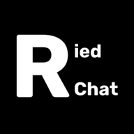

<div align="center">
  

  # RiedChat

  Веб-клиент XMPP для общения 1-на-1 с шифрованием OMEMO и звонками

  [](./LICENSE)

  [](README.md)
  [](README.en.md)
</div>

## Оглавление

- [О проекте](#о-проекте)
- [Возможности](#возможности)
- [Технологии](#технологии)
- [Установка](#установка)
- [Безопасность](#безопасность)
- [Участие в разработке](#участие-в-разработке)
- [Сторонние компоненты](#сторонние-компоненты)
- [Лицензия](#лицензия)

## О проекте

RiedChat - баланс между лёгкостью и функциональностью, которого не даёт
большинство XMPP-клиентов: одни изначально урезаны и не покрывают тот пласт
возможностей, к которому все давно привыкли в современных мессенджерах,
другие тянут за собой тяжеловесные зависимости и всё равно умудряются не
покрывать заявленный функционал. В клиенте нет ни аналитики, ни телеметрии.

## Возможности

- **Звонки** - аудио- и видеозвонки с принудительным шифрованием OMEMO.
- **Стикеры** - можно собирать собственные наборы стикеров и отправлять их
  собеседнику; полученные стикеры кэшируются на обеих сторонах.
- **Видеокружки** - запись видео в кружок длительностью до 1 минуты.
- **Поиск по истории** - с фильтром по типу сообщения: текст, изображение,
  видео, стикер, кружок, файл.
- **Настройки шрифта чата** - кастомный шрифт (загружается пользователем) и
  настраиваемый размер текста.
- **Прочее** - голосовые сообщения, обои чата, редактирование/удаление и
  цитирование сообщений, индикаторы набора/прочтения, статусы присутствия,
  кастомные аватары/vCard.

## Технологии

Vite, ES-модули, [Strophe.js](https://strophe.im/) (XMPP, грузится с CDN),
[libsignal-protocol](https://github.com/signalapp/libsignal-protocol-javascript)
(OMEMO, вендорится как classic-скрипт), Vitest.

## Установка

**Клиент.** Готовая сборка - на [riedchat.github.io/RiedChat](https://riedchat.github.io/RiedChat);
собирать самому нужно только для модификаций или своего хостинга, см.
[docs/INSTALL.md](./docs/INSTALL.md).

**XMPP-сервер.** Нужен в любом случае: требования к нему и пример конфига -
в [docs/SERVER_SETUP.md](./docs/SERVER_SETUP.md).

## Безопасность

О найденных уязвимостях сообщайте согласно [SECURITY.md](./SECURITY.md), а не
через публичные issues.

## Участие в разработке

Pull request'ы приветствуются. Перед первым вкладом ознакомьтесь с
[CODE_OF_CONDUCT.md](./CODE_OF_CONDUCT.md); отправка pull request означает
согласие с условиями [CLA.md](./CLA.md).

## Сторонние компоненты

Проект использует Strophe.js (MIT) и libsignal-protocol (GPL-3.0, вендорится
без изменений) - полный список сторонних компонентов и их лицензий в
[THIRD-PARTY-NOTICES.md](./THIRD-PARTY-NOTICES.md).

## Лицензия

Распространяется на условиях GNU Affero General Public License, как указано
в файле [LICENSE](./LICENSE).

```
Copyright (C) 2026 RiedChat Contributors

Эта программа - свободное программное обеспечение: вы можете распространять
и/или изменять её на условиях GNU Affero General Public License, опубликованной
Free Software Foundation, либо версии 3 этой лицензии, либо (по вашему выбору)
любой более поздней версии.

Эта программа распространяется в надежде, что она будет полезна, но БЕЗ КАКИХ-ЛИБО
ГАРАНТИЙ; даже без подразумеваемой гарантии ТОВАРНОЙ ПРИГОДНОСТИ или ПРИГОДНОСТИ
ДЛЯ ОПРЕДЕЛЁННОЙ ЦЕЛИ. Подробнее см. текст GNU Affero General Public License.

Вы должны были получить копию GNU Affero General Public License вместе с этой
программой. Если нет - см. <https://www.gnu.org/licenses/>.
```

